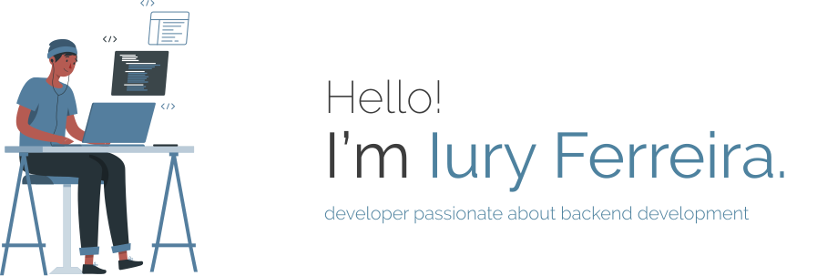
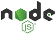
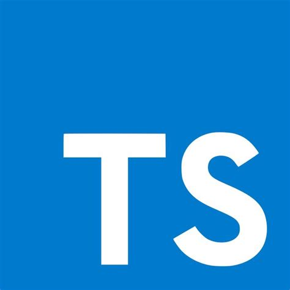
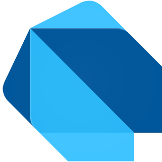

 

### ✌ Tudo bem?

Parece que você encontrou meu perfil no Github.  

Prazer! Meu nome é **Iury Ferreira** e sou apaixonado por desenvolvimento de software. Comecei a programar em 2012 e até hoje não parei, continuo me aperfeiçoando para me tornar um programador melhor e entregar boas soluções. Desenvolvimento back-end e é a minha paixão, mas tenho uma boa experiência em programação frontend/mobile.

Aqui você encontrará boa parte dos projetos que me divirto fazendo e que contribuem com a comunidade. Sinta-se livre para fazer *pull requests* e abrir *issues* quando quiser, será uma honra poder conversar com você!

### 💻 Tecnologias

Aqui estão as tecnologias, linguagens e *frameworks* que utilizo diariamente em meus projetos.

 

### 📦 Main Open-Source Projects

Já que você está por aqui, confira alguns dos projetos em que tenho trabalhado atualmente.

[⛪ Idigis - Web system for church management, written entirely in C#](https://github.com/iuryferreira/idigis)

[🔔 Notie - user-friendly library for notifications in .NET, written in C#](https://github.com/iuryferreira/notie)

[🔐 Hashio - user-friendly library for hashing passwords in .NET Core, written in C#](https://github.com/iuryferreira/hashio)

[📝 Todart - manage your tasks easily and intuitively in the best app, written in Dart](https://github.com/iuryferreira/todart)

[📚 Python Data Structures - repository contains the implementations of the most used data structures, written in Python](https://github.com/iuryferreira/python-data-structures)

[🔆 ThemeTime - utility to change theme variations (light/dark) in the budgie/gnome environment based on the chosen time](https://github.com/iuryferreira/ttime)

[⚙ Dart SDK for Solus OS - a simple way the dart sdk on your solus os](https://github.com/iuryferreira/dart-solus-os)

[🖥 SortK - desktop app for gift draw at SCFDS - 2018, written in tkinter (python)](https://github.com/iuryferreira/sortk-desktop)

 

### Hey! 📢

  

   

***Obrigado pela sua visita, envie-me um email para qualquer dúvida ou até mesmo para bater um papo, estou ansioso por isso!*** 😄

